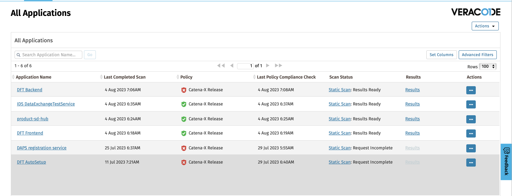
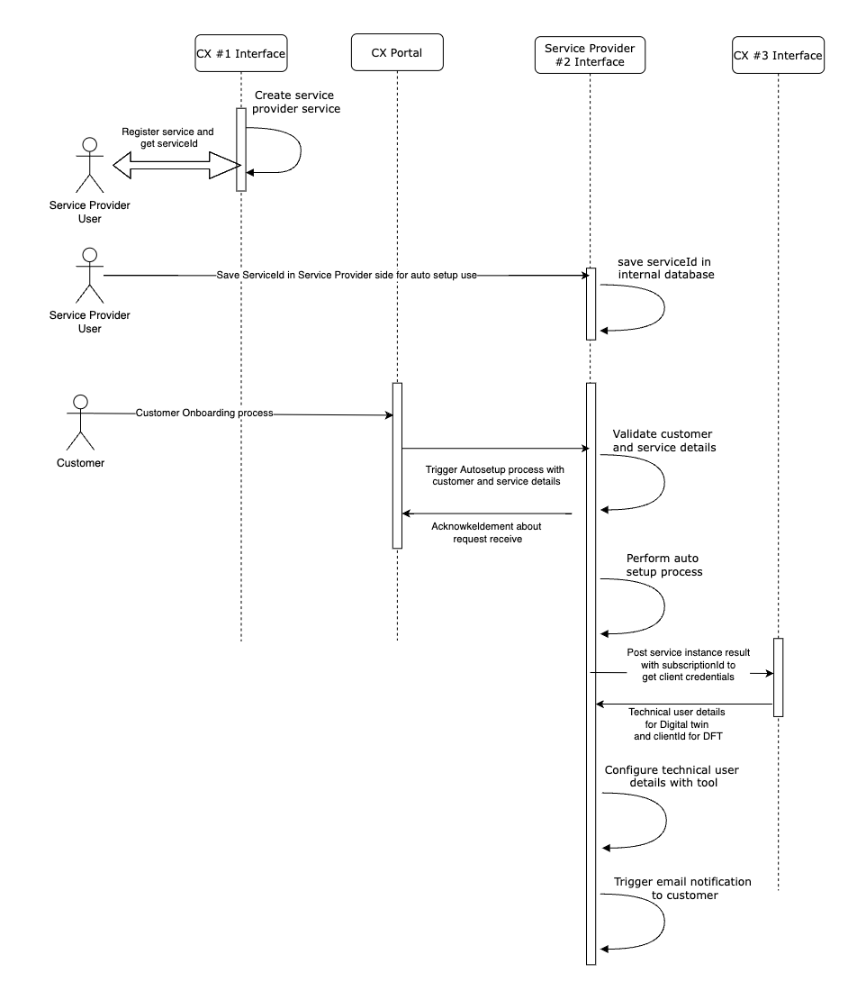
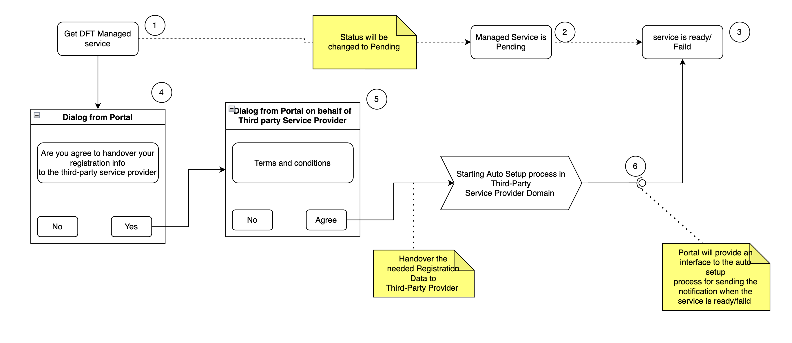
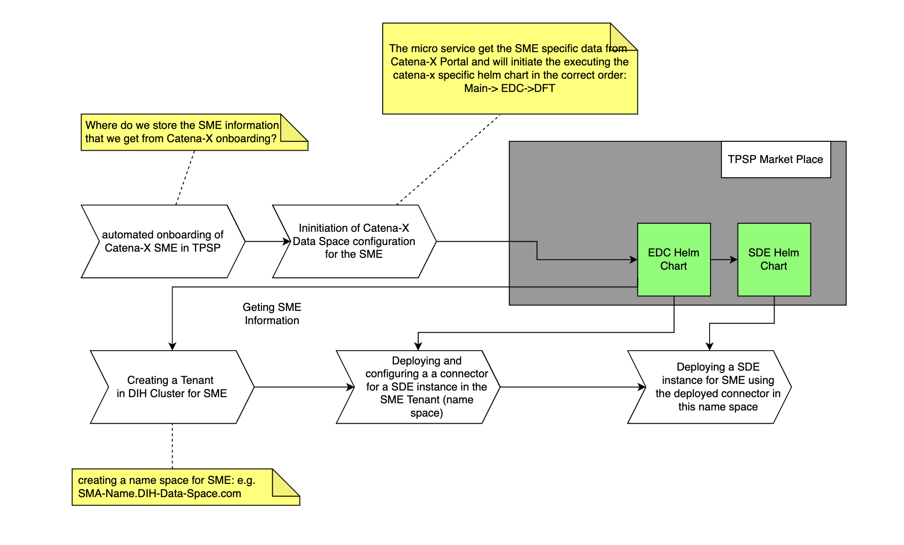

# SDE - User Guide

## 

## About arc42
arc42, the Template for documentation of software and system architecture.
By Dr. Gernot Starke, Dr. Peter Hruschka and contributors.
Template Revision: 7.0 EN (based on asciidoc), January 2017
© We acknowledge that this document uses material from the arc 42 architecture template, http://www.arc42.de. Created by Dr. Peter Hruschka & Dr. Gernot Starke.
This version of the template contains some help and explanations. It is used for familiarization with arc42 and the understanding of the concepts. For documentation of your own system you use better the plain version.

## Introduction and Goals

To provide auto-setup procedure of Data Provider components (EDC,SDE) aaS for KMU/SME  as a  Blueprint solution for third-party managed service.

SDEis a simple component provided by Catena-X named Data Format Transformer. Its purpose is to enable small and medium enterprises (SMEs) to upload data for a digital twin submodel registered in a digital twin registry. This data, in turn, can be accessed via a request to the inherent EDC instance. In the subsequent figure, this is sketched. 

## Requirements Overview

## )

What is necessary to enable third-party platform to provide SDEas a managed service by third-party for an SME of Catena-x?

Requirements:

SDEmust be a selectable item in marketspace of third-party
(providing an instance of EDC, SDEbackend, SDEFrontend, and storage as a in the third-party service provider tenant)
Onboarding:

Onboard SME/Company in third-party. (what data are necessary to  be able to do this without interaction of SME/Company)
Customers will only have access to SDEFrontend, but not any access to managed data space itself
Auto-Setup:

1. deploy EDC
2. register EDC instance at Catena-X DAPS
3. deploy SDE(Frontend, backend, and storage in one pod?)
4. configure the SDEbackend to get access to Digital Twin Registry
5. configure SDEFrontend to be accessed via oidc token vom Catena-X Portal
6. configure the SDEbackend to provide the correct link in Digital Twin Registry to its EDC instance
7. configure EDC to allow authorized requests to request data registered in Digital Twin Registry

## Quality Goals

| Priority | Quality-Goal | Scenario                                                         |
|----------|--------------|------------------------------------------------------------------|
| 1        | Security     | Protecting API against unauthorized access. Protecting the Keys. |
| 2        | Integrity    | Data can be managed only via registered services.                |
| 3        | Reliability  | The microservices are available 99.9999%.                        |
| 4        | Ease-of-use  | The auto setup process will provide ease-of-use APIs             |

## Architecture Constraints

The process has to comply with IDSA, GAIA-X, and Catena-X principles.

# System Scope and Context
## Auto setup Process in third-party domain

## 

## Business Context
**Contents.**

Specification of all communication partners (users, IT-systems, …) with explanations of domain specific inputs and outputs or interfaces. Optionally you can add domain specific formats or communication protocols.

**Motivation.**

All stakeholders should understand which data are exchanged with the environment of the system.

**Form.**

All kinds of diagrams that show the system as a black box and specify the domain interfaces to communication partners.
Alternatively (or additionally) you can use a table. The title of the table is the name of your system, the three columns contain the name of the communication partner, the inputs, and the outputs.

**<Diagram or Table>**

**<optionally: Explanation of external domain interfaces>**

### Technical Context

### **APIs for exchanging the data between The Portal and Auto-Setup process**

## )

### Interfaces:
1. **Third-PartyAuto Setup process:**
This interface will be provided by the third service provider (T-systems for blueprint), and will be called from a portal once the customer pushes the "get managed SDEservice" button. This a push-interface, where the portal can push the needed information to the third-party service provider
2. **SDEregistration interface:**
The portal will provide this interface to register the SDEwith an SME-individual user credentials
3. **SD-HUB Registration Service:**
This interface has to be provided by the portal. The owner of connectors has to use this interface to create the SD-Document for the connector.
4. **Digital Registry Registration Service:**
This service has to be provided by the digital twin team and will be used by SDE to register the metadata of the provided data
5. **DAPS Registration Service:**
This interface will be implemented by T-Systems. This interface has to provide by Catena-X for the registration of connectors to the Catena-X DAPS

## 

### Initial attributes needed from Portal to start the Auto setup process:

**Information needed for the Onboarding of the customer in the third-party service provider:**

The third-party service provider has to provide the service bill to the customer. So my suggestion for that information:

- Postal Address
- E-Mail Address
- legal information such as TAX-Number and company registration number

**Information needed for the connector certificate:**

- Country Name (2 letter code) [AU]
- State or Province Name (full name) [Some-State]
- Locality Name (eg, city)
- Organization Name
- Organizational Unit Name

## Information needed for Connector registration in DAPS:

- The endpoint of the DAPS registration service
- Public Key of the connector certificate
- The endpoint of the connector
- The BPN of the connector

## Information needed for Connector registration in Factory:

**see Arc42 for SD-Factory**
- The endpoint of the SD-Hub registration service
- User credential for accessing the SD-Hub registration service

## Information needed for registering the metadata in Digital-Registry-Service

**See Arc42 for Digital Twin Registry**
- User credential for accessing the Digital-Registry-Service
- The endpoint of Digital-Registry-Service

## API Specification:
### SD-Factory API:
SD-Factory has only one endpoint - POST /selfdescription  with the generic request body, which should contain mandatory fields holder  and issuer. The response body is dependent on a request.

### DAPS Registration API:
To register a Certificate to the DAPS an authenticated client (known client with an appropriate role, a concrete role can be configured in configuration file) sends POST multipart request to the DAPS registration service endpoint

Media Type: multipart/form-data

POST /api/v1/daps

here are interface definition in java:

public void createClient(
@RequestParam String clientName,
@RequestParam(required = false) String securityProfile,
@RequestParam(required = false) String referringConnector,
@RequestPart("file") MultipartFile file)
parameters securityProfile and referringConnector are optional, for securityProfile the default value is used, if referringConnector is missed than it is not included in DAT

### Auto Setup API:
**The description of API here** Auto Setup API information

- The auto setup process is secured by the service provider key cloak.
- The service provider will create a technical user to allow access to auto-setup service API.

Swagger API info as below:

| Environment   | Details                                                                   |
|---------------|---------------------------------------------------------------------------|
| T-systems Dev | Swagger info: https://orchestrator.cx.dih-cloud.com/swagger-ui/index.html |

| Sr. | Request                                                                                                                                                                                                                                                                                                                                                                                                                                                                                                                                                                                                                                                                                                                                                                                                                                                                                                                                                                                                                                                                                                                                                                                                                                                                                                                                                                                                                                                                                                                                                                                                                                                                                                                                                                                                                                                                                                                                                                                                                                                                                                                                        | Response                                                                                                                                                                                                                                                                                                                                                                                                                                                                                                                                                                                                                                                                                                                                                                                                                                                                                                                                                                                                                                                                                                                                                                                                                                                                                                                                                                                                                                                                                                                                                                                                                                                                                                                                                                                                                                                                                                                                                                                                                                                                                                                                                                                                                                                                                                                                                                                                                                                                                                                                                                                                                                                                                                                                                                                                                                                                                                                   |
|-----|------------------------------------------------------------------------------------------------------------------------------------------------------------------------------------------------------------------------------------------------------------------------------------------------------------------------------------------------------------------------------------------------------------------------------------------------------------------------------------------------------------------------------------------------------------------------------------------------------------------------------------------------------------------------------------------------------------------------------------------------------------------------------------------------------------------------------------------------------------------------------------------------------------------------------------------------------------------------------------------------------------------------------------------------------------------------------------------------------------------------------------------------------------------------------------------------------------------------------------------------------------------------------------------------------------------------------------------------------------------------------------------------------------------------------------------------------------------------------------------------------------------------------------------------------------------------------------------------------------------------------------------------------------------------------------------------------------------------------------------------------------------------------------------------------------------------------------------------------------------------------------------------------------------------------------------------------------------------------------------------------------------------------------------------------------------------------------------------------------------------------------------------|----------------------------------------------------------------------------------------------------------------------------------------------------------------------------------------------------------------------------------------------------------------------------------------------------------------------------------------------------------------------------------------------------------------------------------------------------------------------------------------------------------------------------------------------------------------------------------------------------------------------------------------------------------------------------------------------------------------------------------------------------------------------------------------------------------------------------------------------------------------------------------------------------------------------------------------------------------------------------------------------------------------------------------------------------------------------------------------------------------------------------------------------------------------------------------------------------------------------------------------------------------------------------------------------------------------------------------------------------------------------------------------------------------------------------------------------------------------------------------------------------------------------------------------------------------------------------------------------------------------------------------------------------------------------------------------------------------------------------------------------------------------------------------------------------------------------------------------------------------------------------------------------------------------------------------------------------------------------------------------------------------------------------------------------------------------------------------------------------------------------------------------------------------------------------------------------------------------------------------------------------------------------------------------------------------------------------------------------------------------------------------------------------------------------------------------------------------------------------------------------------------------------------------------------------------------------------------------------------------------------------------------------------------------------------------------------------------------------------------------------------------------------------------------------------------------------------------------------------------------------------------------------------------------------------|
| 1   | API info: This API will use to start the Auto setup process  HTTP Request details:  Method: POST  Host: [https://orchestrator.cx.dih-cloud.com](https://orchestrator.cx.dih-cloud.com)  URI: /autosetup  Request Header:  Authorization: Bearer "`<token>`"  Note: Need to get valid auth token from service provider key cloak service using technical user  Request Body:    {     "customer" : {    "organizationName": "string"[required] ,      "organizationUnitName":"string",      "country": "string" [required],      "state": "string",      "city": "string",      "email": "string" [required],      "contactNumber":"string",      "tanNumber": "string",      "registrationNumber":"string",  }      "properties": {          "bpnNumber": "string" [required],           "subscriptionId": "string" [required],           "serviceId": "string" [required],          "role": "string"      }  }  }      E.g.  {  "customer": {  "organizationName": "Test Company",  "email": "test@email.com",  "country": "de"  },  "properties": {  "bpnNumber": "TEST00000003CSGV",  "subscriptionId": "40e038ad-9bc5-44f8-99e0-0e7b4579a37a",  "serviceId": "5cf74ef8-e0b7-4984-a872-474828beb5d9"  }  }    Curl request e.g.  curl \      -X POST \      "https://orchestrator.cx.dih-cloud.com/autosetup" \      --header "Authorization: Bearer <token>" \      --header "Content-Type: application/json" \     --data-raw '{              "customer": {            "organizationName": "Test Company",             "email": "test@email.com",            "country": "de"           },          "properties": {         "bpnNumber": "TEST00000003CSGV",          "subscriptionId": "40e038ad-9bc5-44f8-99e0-0e7b4579a37a",         "serviceId": "5cf74ef8-e0b7-4984-a872-474828beb5d9"        }     }'\      -s -o /dev/null -w 'Response Code: %{http_code}\n'       | String execution Id       E.g.   ["c18c4774-5436-4700-a01d-bffd2db64c10"]()  Note: After getting execution Id you can track status by using #2nd API                                                                                                                                                                                                                                                                                                                                                                                                                                                                                                                                                                                                                                                                                                                                                                                                                                                                                                                                                                                                                                                                                                                                                                                                                                                                                                                                                                                                                                                                                                                                                                                                                                                                                                                                                                                                                                                                                                                                                                                                                                                                                                                                                                                                                                                                                                                                                                                                                                                                                                                                                                                                                                                                                                                                                   |
| 2   | API info: This API will use to check/verify Auto setup process status  HTTP Request details:  Method: GET  Host: https://orchestrator.cx.dih-cloud.com  URI: /autosetup/<executionId>  Request Header:  Authorization: Bearer "`<token>`"      Note: Need to get valid auth token from service provider key cloak service using technical user      Request Body:  N/A          Curl request e.g.     curl \      -X GET\      "https://orchestrator.cx.dih-cloud.com/autosetup/<executionId>" \      --header "Authorization: Bearer <token>" \       -s -o /dev/null -w 'Response Code: %{http_code}\n'                                                                                                                                                                                                                                                                                                                                                                                                                                                                                                                                                                                                                                                                                                                                                                                                                                                                                                                                                                                                                                                                                                                                                                                                                                                                                                                                                                                                                                                      | Response Type 1:  If Auto set up process is in process  {       "executionId": "c18c4774-5436-4700-a01d-bffd2db64c10",       "executionType": "CREATE", /*UPDATE/DELETE*/        "request":  {               "customer": {            "organizationName": "Test Company",             "email": "test@email.com",            "country": "de"           },          "properties": {         "bpnNumber": "TEST00000003CSGV",          "subscriptionId": "40e038ad-9bc5-44f8-99e0-0e7b4579a37a",         "serviceId": "5cf74ef8-e0b7-4984-a872-474828beb5d9"        }      },     "processResult": [],      "createdTimestamp": "2022-09-06T08:07:45.442755845",      "modifiedTimestamp": "2022-09-06T08:09:20.063916819",      "status": "INPROGRESS"  }        Response Type 2:  If Auto set up process is in success  {       "executionId": "c18c4774-5436-4700-a01d-bffd2db64c10",       "executionType": "CREATE",        "request": {             "customer": {            "organizationName": "Test Company",             "email": "test@email.com",            "country": "de"           },          "properties": {         "bpnNumber": "TEST00000003CSGV",          "subscriptionId": "40e038ad-9bc5-44f8-99e0-0e7b4579a37a",         "serviceId": "5cf74ef8-e0b7-4984-a872-474828beb5d9"        }     },        "processResult": [{             "name": "DFT",              "backendUrl": "<url>",              "frontendUrl": "<url>"                   }, {                                  "name": "EDC",                                  "dataPlaneUrl": "<url>",                                  "controlPlaneUrl": "<url>",                                  "apiKeyHeaderName": "string",                                  "apiKey": "string"        }],      "createdTimestamp": "2022-09-06T08:07:45.442755845",      "modifiedTimestamp": "2022-09-06T08:09:20.063916819",      "status": "SUCCESS"  }       Response Type 3: If Auto set up process is FAILED  {          "executionId": "c18c4774-5436-4700-a01d-bffd2db64c10",       "executionType": "CREATE",        "request":  {             "customer": {            "organizationName": "Test Company",             "email": "test@email.com",            "country": "de"           },          "properties": {        "bpnNumber": "TEST00000003CSGV",          "subscriptionId": "40e038ad-9bc5-44f8-99e0-0e7b4579a37a",         "serviceId": "5cf74ef8-e0b7-4984-a872-474828beb5d9"        }     },      "createdTimestamp": "2022-09-06T08:07:45.442755845",      "modifiedTimestamp": "2022-09-06T08:09:20.063916819",      "status": "FAILED"     "remark": "Please connect with technical team for more advice"  }  |
| 3   | API info: This API will use to update the existing packages created by the Auto setup process  HTTP Request details:  Method: PUT  Host: https://orchestrator.cx.dih-cloud.com  URI: /autosetup/<executionId>  Request Header:  Authorization: Bearer "`<token>`"  Note: Need to get valid auth token from service provider key cloak service using technical user     Request Body:   {      "customer" : {      "organizationName": "string"[required] ,      "organizationUnitName":"string",      "country": "string" [required],      "state": "string",      "city": "string",      "email": "string" [required],      "contactNumber":"string",      "tanNumber": "string",      "registrationNumber":"string", }      "properties": {          "bpnNumber": "string" [required],           "subscriptionId": "string" [required],           "serviceId": "string" [required],          "role": "string"      }  }  }   E.g.  {  "customer": {  "organizationName": "Test Company",  "email": "test@email.com",  "country": "de"  },  "properties": {  "bpnNumber": "TEST00000003CSGV",  "subscriptionId": "40e038ad-9bc5-44f8-99e0-0e7b4579a37a",  "serviceId": "5cf74ef8-e0b7-4984-a872-474828beb5d9"  }  }      Curl request e.g.  curl \      -X PUT\      "https://orchestrator.cx.dih-cloud.com/autosetup/<executionId>" \      --header "Authorization: Bearer <token>" \      --header "Content-Type: application/json" \     --data-raw '{             "customer": {            "organizationName": "Test Company",             "email": "test@email.com",            "country": "de"           },          "properties": {         "bpnNumber": "TEST00000003CSGV",          "subscriptionId": "40e038ad-9bc5-44f8-99e0-0e7b4579a37a",         "serviceId": "5cf74ef8-e0b7-4984-a872-474828beb5d9"        }     }'\    -s -o /dev/null -w 'Response Code: %{http_code}\n' | String execution Id     E.g.  "c18c4774-5436-4700-a01d-bffd2db64c10"   Note: After getting execution Id you can track status by using #2nd API                                                                                                                                                                                                                                                                                                                                                                                                                                                                                                                                                                                                                                                                                                                                                                                                                                                                                                                                                                                                                                                                                                                                                                                                                                                                                                                                                                                                                                                                                                                                                                                                                                                                                                                                                                                                                                                                                                                                                                                                                                                                                                                                                                                                                                                                                                                                                                                                                                                                                                                                                                                                                                                                                                                                                             |
| 4   | API info: This API will use to delete the existing packages created by the Auto setup process  HTTP Request details:  Method: DELETE  Host: https://orchestrator.cx.dih-cloud.com  URI: /autosetup/<executionId>  Request Header:   Authorization: Bearer `<token>`  Note: Need to get valid auth token from service provider key cloak service using technical user     Request Body:   N/A     Curl request e.g.  curl \     -X DELETE\     "https://orchestrator.cx.dih-cloud.com/autosetup/<executionId>" \     --header "Authorization: Bearer <token>" \       -s -o /dev/null -w 'Response Code: %{http_code}\n'                                                                                                                                                                                                                                                                                                                                                                                                                                                                                                                                                                                                                                                                                                                                                                                                                                                                                                                                                                                                                                                                                                                                                                                                                                                                                                                                                                                                                                                                        | String execution Id  E.g.  "c18c4774-5436-4700-a01d-bffd2db64c10"  Note: After getting execution Id you can track status by using #2nd API                                                                                                                                                                                                                                                                                                                                                                                                                                                                                                                                                                                                                                                                                                                                                                                                                                                                                                                                                                                                                                                                                                                                                                                                                                                                                                                                                                                                                                                                                                                                                                                                                                                                                                                                                                                                                                                                                                                                                                                                                                                                                                                                                                                                                                                                                                                                                                                                                                                                                                                                                                                                                                                                                                                                                                     |

- **Third-PartyAuto Setup process: Defining the API of Dataspace setup process for portal CLOSED**
    - the portal uses POST requests passing the required parameters to the AutoSetup process as a multipart form data

- **SD-HUB Registration Service:**
  - SD-Hub have only one endpoint - POST /selfdescription  with the generic request body, that should contain mandatory fields holder  and issuer .

- **DAPS Registration Service:**
  - DAPS registration service provides CRUD operations for maintaining a client in DAPS service for an authenticated user (keycloak) with appropriate roles. The operations are:
        
    - creating a client and registering its certificate
    - updating client and changing its attributes in DAT
    - retrieving client information
    - deleting a client

- **Digital Twin Registry Registration Service:**
  - See API Documentation of Digital Twin documentation

## Solution Strategy

**The managed service approach should simplify the participants to use the Catena-X Data Space without knowing technical details. Therefore we provide the auto setup process to create a managed tenant for each participant who wants to provide data to the catena-x use cases.**

**Motivation.**

Easy participating Catena-X data space, especially for SMEs.

**Form**

To hide all complexity from the participant, a third-party service provider provide a managed area where an isolated managed namespace will be created for the participant. The auto-setup process will deploy all required components and configurations for the participant. The result is a ready-to-use managed service, in our case, the Simple Data Exchanger (former DFT), which can be used directly by the customer to provide his data to the catena-x use cases.

### Runtime View

## Needed Dialog for Auto Setup Process:

## 

### Deployment View

## 

In Catena-X we use ARGO-CD for deployment 
[README.md](https://github.com/catenax/kubeapps-orchestrator-service/blob/main/README.md) describe the deployment process

 

### Quality Requirements 
See Catena-X Quality Gate Documentation

### Glossary

| Term                                    | Description                                                                                                                                                                                                                                                                  |
|-----------------------------------------|------------------------------------------------------------------------------------------------------------------------------------------------------------------------------------------------------------------------------------------------------------------------------|
| Gaia-X                                  | Gaia-X represents the next generation of data infrastructure ecosystem: an open, transparent, and secure digital ecosystem, where data and services can be made available, collated and shared in an environment of trust.                                                   |
| Catalogue                               | A Catalogue presents a list of available Service Offerings. Catalogues are the main building blocks for the publication and discovery of Self-Descriptions for Service Offerings by the Participants.                                                                        |
| (Catena-X Data Space)                   | A Data Space is a virtual data integration concept defined as a set of participants and a set of relationships among them, where participants provide their data resources and computing services.                                                                           |
| Catena-X Portal / Onboarding Process    | The portal is used for the registration/onboarding process in Catena-X and includes the login, user management and the initial registration.                                                                                                                                 |
| Claim                                   | An assertion made about a subject.                                                                                                                                                                                                                                           |
| Custodian Wallet / Catena-X wallet      | The Custodian Wallet interface is a cross product interface which is used to share the company name as well as the company bpn to the custodian service. The service uses those data to create a new wallet for the company. The wallet will hold the company name and bpn.  |
| Decentralized Identifier (DID)          | Decentralized Identifiers are a new type of identifiers that enables verifiable, decentralized digital identity.                                                                                                                                                             |
| Federated Services                      | Federation Services are services required for the operational implementation of a Gaia-X Data Ecosystem.                                                                                                                                                                     |
| Federation                              | A Federation refers to a loose set of interacting actors that directly or indirectly consume, produce, or provide resources.                                                                                                                                                 |
| Holder                                  | Is the user that holds the verifiable credentials.                                                                                                                                                                                                                           |
| Issuer                                  | Is an instance that can issue verifiable credentials.                                                                                                                                                                                                                        |
| Keycloak                                | Keycloack is an open-source Identity Management and Access management solution that allows Single Sign-On.                                                                                                                                                                   |
| Self-Description                        | A machine-readable File (json-lD) that contains description about Participants and Services.                                                                                                                                                                                 |
| Self-Description Factory                | SD-Factory creates a Verifiable Credential based on the information taken from OS, unlocks Private Key from CX-wallet and signs it with Catena-X key.                                                                                                                        |
| Self-Description Graph                  | The Self-Description Graph contains the information imported from the Self-Descriptions that are known to the Catalogue and have an “active” lifecycle state.                                                                                                                |
| Self-Description Hub                    | The Self-Description Hub's (SD Hub) store Self Descriptions in order to provide a flat catalogue of SDs                                                                                                                                                                      |
| Self-Description Validator              | The Self-Description validator is provided by Gaia-X. With that any Self Descriptions can be checked against an instance of the validator.                                                                                                                                   |
| SDE                                     | Simple Data Exchanger (former DFT).                                                                                                                                                                                                                                          |
| (Verifiable) Credential                 | A set of one or more Claims made and asserted by an issuer.                                                                                                                                                                                                                  |
| Verifiable Presentation                 | The expression of a subset of one's persona is called a verifiable presentation.                                                                                                                                                                                             |
| Verifier                                | Is an instance that verifies the verifiable credentials of the holder.                                                                                                                                                                                                       |
